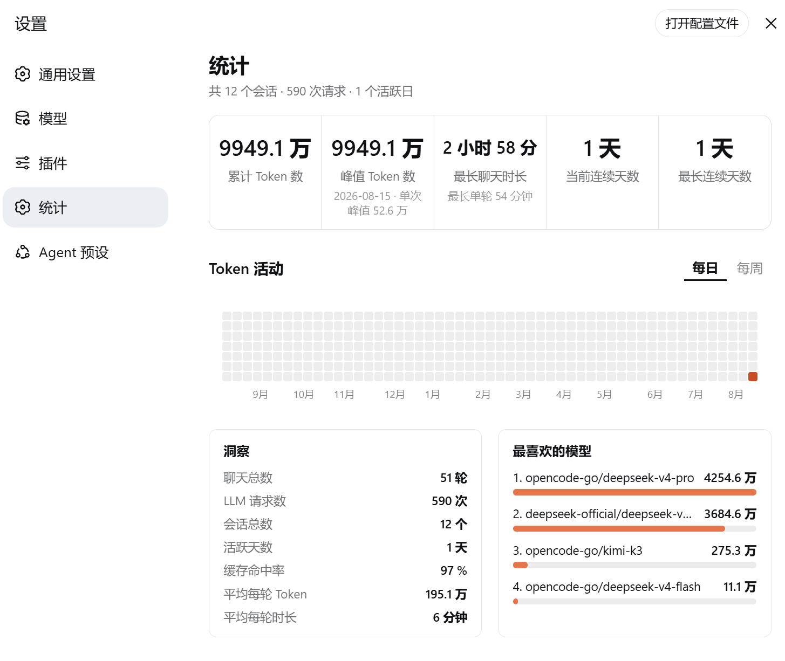

# dsh-token-stats — Codex-style token usage dashboard

[](LICENSE)
[](https://github.com/topics/dsh-plugin)
[](https://github.com/topics/deepseek-harness)

English | [简体中文](README.zh.md)

A Codex-style token usage dashboard for [DeepSeek Harness](https://github.com/deepseek-ai/deepseek-harness) (dsh) Web UI:
5 stat cards + a GitHub-style activity heatmap (daily / weekly) + insights + per-model usage ranking.
The UI follows the DSH language setting: Chinese interface → Chinese dashboard, anything else → English.



## ✨ Features

- **5 stat cards**: total tokens / peak tokens (single day) / longest chat / current streak / longest streak; auto-shrinking one-line values
- **Heatmap**: 53×7 rolling grid (today pinned to the bottom-right corner), hover for `Aug 15, 2026: 273k tokens · 34 requests`;
  **Daily / Weekly** view toggle (weekly = bottom-up 7-cell bars, hover for the week total)
- **Insights**: total turns, LLM requests, sessions, active days, cache hit rate, avg tokens & duration per turn
- **Favorite models**: provider/model token ranking (Top 5) with ratio bars
- **Data source**: session logs (`assistant/message` usage + `request/header` model attribution + `turn/start`/`turn/end` durations), live incremental updates, no extra persistence

## 🚀 Install (bundle)

```sh
dsh plugin --profile web add github:solstice621/dsh_dashboard
dsh --profile web   # restart to apply
```

Then open **Settings → Stats** for the full dashboard. Local install:
`dsh plugin --profile web add file:/path/to/dsh-dashboard`.

> On first open the plugin scans all historical sessions (seconds to a minute), then updates
> in real time via `session/event`; the dashboard auto-refreshes every 30s — no manual action needed.

## 🧑‍💻 Dynamic-plugin deployment (maintainers)

This repo also maintains a dynamic Cordis plugin (`toksta-5`, deployed in-session via `cordis_define`,
handy for iterating without restarting the profile):

1. Verify contracts with `cordis_inspect_list` / `cordis_inspect_query` (sessionQuery, session/event,
   session/created, harness, React/host/styles builtins, settings.section, timer, locale);
2. `cordis_define`: `plugin.kind: "new"`, `idPrefix: "toksta"`, `code.host` = `host.js`, `code.client` = `client.js`;
3. `cordis_run` (mode=`run`/`update`) to activate.

> ⚠️ The bundle and the dynamic plugin register the same settings section id (`token-stats`);
> don't run both at once — stop one before enabling the other.

## 📁 Files

| File | Description |
| --- | --- |
| `lib/index.js` | **Bundle host half**: folder + backfill + live listeners + `GET /api/token-stats` (`POST /api/token-stats/rescan` as fallback) |
| `lib/client.js` | **Bundle client half**: `window.__ModuleLoader__.load` factory, registers "Settings → Stats" |
| `cordis.patch.yml` | bundle patch: inserts the `id: token-stats` plugin row |
| `package.json` | npm package manifest (`dsh.bundle` / `dsh.client`) |
| `host.js` / `client.js` | Dynamic-plugin host/client function bodies (paste into `cordis_define`) |
| `plugin.json` | Plugin metadata & package history (pkg-9 … pkg-27) |
| `plan.md` / `progress.md` | Design docs & progress log (incl. every bug/fix) |
| `assets/dsh_dashboard.png` | Dashboard screenshot |

## ✅ Acceptance checklist

- [ ] Settings → Stats: 5 equal-width cards, one-line values, aligned labels
- [ ] 53-column heatmap, today at bottom-right, year-month-day hover tips; Daily/Weekly toggle works
- [ ] Month axis aligned to columns; no horizontal scrollbar
- [ ] Insights (7 rows) and Top-5 model ranking with bars correct
- [ ] New conversations show up within 30s
- [ ] Language switch (zh ↔ en) relabels the whole dashboard on the fly

## 🩺 Troubleshooting

| Symptom | Cause / fix |
| --- | --- |
| `pnpm not found on PATH` | `dsh plugin` needs pnpm: `corepack enable pnpm` (bundled with Node ≥16.10) |
| Two "Stats" sections in Settings | bundle + dynamic plugin (toksta-5) both active; stop one |
| Plain text, no styles at all | CSS not injected: dynamic `styles` is a Client Builtin (`styles.insert(css)`), not `ctx.get('styles')`; bundle injects via `<style>` |
| Client render crash `ctx is not defined` | `ctx` only exists in `apply(ctx)`; components use the module-level timer bridge (`intervalRef = (cb, ms) => ctx.interval(...)`) |
| `service "timer" is not declared` | client has no timer Service; drop `inject: ['timer']` |
| Horizontal scrollbar flashes under the heatmap | old month-label `nowrap` text inflated scrollable overflow; container & month row are `overflow:hidden` now |
| `console.warn` throws | Host builtins only expose `console.log/error`; use `console.error` |

## 📐 Known boundaries

- Only calls whose adapter reports `usage` are counted (skipped when `assistant/message.usage` is absent);
- Model attribution: `assistant/message` has no model field — usage is attributed to the session's latest
  `request/header` provider/model;
- Current streak counts to yesterday when today has no usage; interrupted (unclosed) turns add no duration;
- Title-generation calls (`session/title-llm-request`) are not counted.

## 🌐 Ecosystem

- ✅ Listed in [dsh-plugin-marketplace](https://github.com/YELEBAI/dsh-plugin-marketplace): scanner-verified
  (`verified`, one-click install pinned to `github:solstice621/dsh_dashboard#<commit>`, auto-refreshed every 2h);
- 🚀 [awesome-deepseek-harness](https://github.com/0xsline/awesome-deepseek-harness) listing PR submitted:
  `docs: add dsh-dashboard` (UI & Experience, bilingual entry).

## 📄 License

MIT
